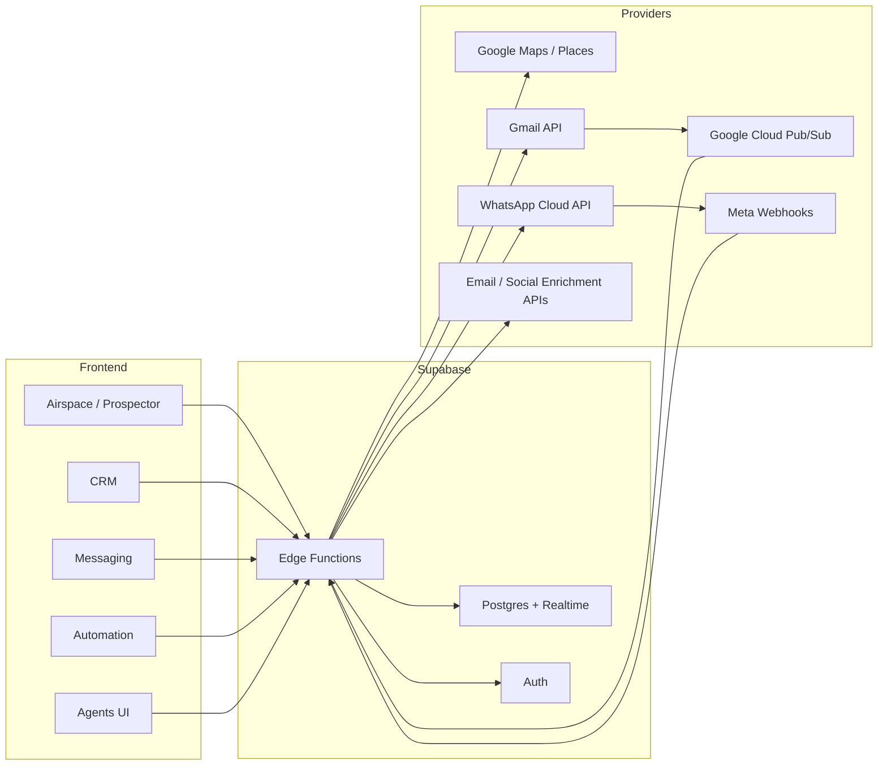

# OCULOPS OS Operations Architecture

Updated: March 7, 2026

## Goal

Operate a single execution system where:

- Atlas scans a live place and persists the scan.
- Each detected business becomes a durable prospect record.
- Qualified prospects are promoted into CRM entities.
- Messaging can send outbound through real providers, not browser deep-links.
- Inbound replies and provider status updates are written back into the same conversation timeline.
- Automations and agents run against the same source of truth.

## Operating principles

- One persisted lead model for all prospecting views.
- One conversation model for all channels.
- One activity timeline for CRM, agents, outreach, and automations.
- Edge functions own provider credentials and outbound delivery.
- Frontend never talks directly to Gmail or Meta APIs.
- External provider state is mirrored locally so the app can recover after restarts.

## System map

## Source-of-truth entities

## Prospecting

- `prospector_scans`
  - One row per Airspace/Scanner execution.
  - Stores query, location, radius, area resolution, search center, status, and raw payload.
- `prospector_leads`
  - One row per discovered business.
  - Stores normalized business identity, coordinates, phone, website, scoring, enrichment, and CRM promotion links.

## CRM

- `companies`
  - Canonical business account.
- `contacts`
  - Canonical decision-maker or primary contact.
- `deals`
  - Commercial opportunity tied to company/contact.
- `crm_activities`
  - Immutable operational timeline.

## Messaging

- `messaging_channels`
  - Real provider connections.
  - Gmail is OAuth-backed.
  - WhatsApp Cloud is token-backed and server-managed.
- `conversations`
  - Unified thread per contact and channel.
- `messages`
  - Every outbound/inbound message, including delivery status transitions.

## Automation and agents

- `automation_workflows`
  - Stored workflow definitions.
- `automation_runs`
  - Execution log.
- `agent_registry`, `agent_tasks`, `agent_logs`, `agent_messages`
  - Agent control plane.

## Channel architecture

## Gmail

- Connection flow
  - Frontend asks `messaging-channel-oauth` to begin Gmail OAuth.
  - Edge function creates or reuses a `messaging_channels` row.
  - Google redirects back to the edge callback.
  - Callback exchanges auth code for tokens, stores refresh token, resolves mailbox email, and optionally activates Gmail watch.

- Outbound flow
  - Frontend calls `messaging-dispatch`.
  - Edge function refreshes access token from stored refresh token.
  - Edge function builds RFC 2822 MIME content, base64url encodes it, and sends through Gmail API.
  - Message row is updated with provider message ID, status, sent timestamp, and raw provider response.

- Inbound flow
  - Gmail mailbox watch publishes into Google Cloud Pub/Sub.
  - Pub/Sub pushes to `gmail-inbound`.
  - Edge function loads mailbox history since last known history ID, resolves new messages, maps them to contacts/conversations, and stores inbound rows.
  - After persistence, active `message_in` workflows are executed by the shared automation runner.

## WhatsApp Cloud API

- Connection flow
  - A server-managed `messaging_channels` row is created from environment-backed Meta credentials.
  - Channel metadata stores WABA and phone number identity.

- Outbound flow
  - Frontend calls `messaging-dispatch`.
  - Edge function sends a real WhatsApp message through Graph API using the configured phone number ID.
  - Outbound message row stores returned `wamid`, status, timestamps, and raw provider response.

- Inbound flow
  - Meta posts to `whatsapp-webhook`.
  - Webhook verifies signature.
  - Incoming user messages create or update contacts, conversations, and inbound messages.
  - Status webhooks update existing outbound message rows to `sent`, `delivered`, `read`, or `failed`.
  - After persistence, active `message_in` workflows are executed by the shared automation runner.

## Prospecting architecture

- `google-maps-search`
  - Resolves area or coordinates.
  - Returns normalized places.
- `useProspector.recordScan`
  - Persists the scan in `prospector_scans`.
  - Upserts all normalized businesses into `prospector_leads`.
- UI tabs
  - `Airspace` is the execution cockpit.
  - `Scanner`, `Mapa`, and `Leads` must read the persisted prospect tables, not separate local result sets.

## Agent architecture

- `agent-atlas`
  - Area-level mapping and zone summary.
- `agent-hunter`
  - Lead extraction and prioritization from persisted prospects.
- `agent-strategist`
  - Commercial brief, pain points, and tactical next steps.
- `agent-cortex`
  - Orchestrator that calls Atlas, Hunter, Strategist, and Outreach on the same scan context.
- `agent-outreach`
  - Curates, approves, and dispatches drafts or live sends.

## Automation execution architecture

- `automation-runner`
  - Executes a single workflow or all active workflows for a trigger key.
  - Writes every execution into `automation_runs`.
  - Resolves `compose_message`, `crm_activity`, `create_deal`, `update_contact`, `run_api`, `run_agent`, `run_connector`, `notify`, and optional `launch_n8n`.
- Trigger entry points
  - `Automation Zone` can run a workflow immediately, optionally with live send for Gmail/WhatsApp.
  - `useAtlasCRM` fires `atlas_import` workflows after lead promotion into CRM.
  - `gmail-inbound` and `whatsapp-webhook` fire `message_in` workflows after storing inbound messages.

## Enrichment architecture

- Email enrichment
  - Runs after lead persistence or CRM promotion.
  - Writes candidate emails and confidence into `contacts` or `prospector_leads`.
- Social enrichment
  - Resolves LinkedIn, Instagram, Facebook, TikTok profiles and stores them in dedicated fields or JSON.
- Decision-maker detection
  - Creates or updates contact candidates with role, confidence, and source.

## Edge function set

- Existing
  - `google-maps-search`
  - `whatsapp-webhook`
  - `manychat-sync`
  - `api-proxy`
  - `meta-business-discovery`
  - `tiktok-business-search`
  - `social-signals`
  - `market-data`

- Required operating set
  - `automation-runner`
  - `messaging-channel-oauth`
  - `messaging-dispatch`
  - `gmail-inbound`
  - `web-analyzer`
  - `ai-qualifier`
  - `agent-atlas`
  - `agent-hunter`
  - `agent-strategist`
  - `agent-cortex`
  - `agent-outreach`

## Deployment requirements

## Google

- OAuth client for web/server app.
- Gmail API enabled.
- OAuth consent configured.
- Redirect URI pointing to `messaging-channel-oauth`.
- Cloud Pub/Sub topic and push subscription for Gmail push notifications.

## Meta

- Business portfolio.
- WABA.
- WhatsApp business phone number.
- System user access token with messaging permissions.
- Webhook subscription for messages and statuses.

## App/runtime

- Public app URL.
- Supabase service role key in edge runtime.
- Provider credentials in environment variables.
- Realtime enabled for conversations, messages, CRM, and prospector tables.

## Execution order

1. Align database schema with the operating model.
2. Add shared provider helpers and outbound dispatch edge functions.
3. Add channel connection flow for Gmail and bootstrap flow for WhatsApp.
4. Persist scans/leads and wire all Prospector tabs to the persisted model.
5. Add inbound webhook/status synchronization.
6. Add enrichment workers and agent orchestration.
7. Add test coverage and deployment checklist.

## Current repo gap

The current frontend already expects:

- `crm_activities`
- `messaging_channels`
- rich `conversations` and `messages`
- rich `prospector_leads` and `prospector_scans`

But the consolidated migration currently checked into the repo does not fully define that model. The next migration must bridge this gap before provider integrations can be considered stable.
