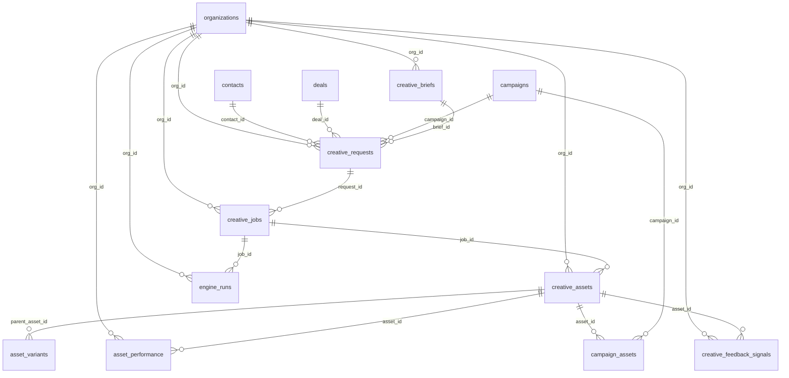

# Creative Factory — Data Model
> OCULOPS | Supabase schema for all creative job persistence
> Agent 5: Data / Library / Feedback Loop Engineer
> Date: 2026-03-11

---

## ERD (Mermaid)



---

## Table Definitions

### 1. `creative_briefs`
DB-backed replacement for the hardcoded brief array in CreativeStudio.jsx.

```
id             UUID PK  default gen_random_uuid()
org_id         UUID     FK → organizations(id)
name           TEXT     NOT NULL
description    TEXT
format         TEXT     -- 'image','video','copy','carousel','reel','story'
platform       TEXT     -- 'instagram','tiktok','meta_ads','email','whatsapp','web'
tone           TEXT     -- 'professional','casual','urgent','inspirational'
objective      TEXT     -- 'awareness','conversion','engagement','retention'
prompt_template TEXT   -- handlebars template: "Create a {{format}} for {{brand}}..."
variables      JSONB    default '[]'  -- [{name, label, type, required}]
example_output TEXT
tags           TEXT[]
is_active      BOOLEAN  default TRUE
usage_count    INT      default 0
created_at     TIMESTAMPTZ default now()
updated_at     TIMESTAMPTZ default now()
```

Indexes:
- `idx_creative_briefs_org` ON (org_id)
- `idx_creative_briefs_format_platform` ON (format, platform)
- `idx_creative_briefs_active` ON (is_active) WHERE is_active = TRUE

---

### 2. `creative_requests`
Who asked for what, from where. The entry point. Created by UI or by FORGE agent.

```
id             UUID PK  default gen_random_uuid()
org_id         UUID     FK → organizations(id)
brief_id       UUID     FK → creative_briefs(id) ON DELETE SET NULL
contact_id     UUID     FK → contacts(id) ON DELETE SET NULL
deal_id        UUID     FK → deals(id) ON DELETE SET NULL
campaign_id    UUID     FK → campaigns(id) ON DELETE SET NULL
requested_by   TEXT     -- 'user' | agent code name (e.g. 'FORGE')
title          TEXT     NOT NULL
description    TEXT
format         TEXT     NOT NULL
platform       TEXT     NOT NULL
tone           TEXT
objective      TEXT
prompt         TEXT     NOT NULL  -- final resolved prompt
variables      JSONB    default '{}'  -- values substituted into brief template
reference_urls TEXT[]
dimensions     JSONB    -- {width, height, aspect_ratio}
duration_sec   INT      -- for video
status         TEXT     default 'pending'
                        CHECK (status IN ('pending','processing','completed','failed','cancelled'))
priority       INT      default 0  -- higher = more urgent
created_at     TIMESTAMPTZ default now()
updated_at     TIMESTAMPTZ default now()
```

Indexes:
- `idx_creative_requests_org` ON (org_id)
- `idx_creative_requests_status` ON (status)
- `idx_creative_requests_campaign` ON (campaign_id)
- `idx_creative_requests_deal` ON (deal_id)
- `idx_creative_requests_created` ON (created_at DESC)

---

### 3. `creative_jobs`
Async job tracking. One request can spawn multiple jobs (e.g. 4 variants).

```
id             UUID PK  default gen_random_uuid()
org_id         UUID     FK → organizations(id)
request_id     UUID     FK → creative_requests(id) ON DELETE CASCADE
engine         TEXT     NOT NULL  -- 'higgsfield','openai_dalle','openai_gpt4o','anthropic','stable_diffusion','manual'
engine_model   TEXT     -- 'higgsfield-1','dall-e-3','gpt-4o',etc.
status         TEXT     default 'queued'
                        CHECK (status IN ('queued','running','completed','failed','cancelled','timed_out'))
attempt        INT      default 1
max_attempts   INT      default 3
input_payload  JSONB    default '{}'  -- exact payload sent to engine
output_payload JSONB    default '{}'  -- raw engine response
error_message  TEXT
error_code     TEXT
queued_at      TIMESTAMPTZ default now()
started_at     TIMESTAMPTZ
completed_at   TIMESTAMPTZ
duration_ms    INT
tokens_used    INT      default 0
cost_usd       NUMERIC(10,6) default 0
created_at     TIMESTAMPTZ default now()
updated_at     TIMESTAMPTZ default now()
```

Indexes:
- `idx_creative_jobs_org` ON (org_id)
- `idx_creative_jobs_request` ON (request_id)
- `idx_creative_jobs_status` ON (status)
- `idx_creative_jobs_engine` ON (engine)
- `idx_creative_jobs_queued_at` ON (queued_at DESC)

---

### 4. `creative_assets`
Generated outputs. Each completed job produces one or more assets.

```
id             UUID PK  default gen_random_uuid()
org_id         UUID     FK → organizations(id)
job_id         UUID     FK → creative_jobs(id) ON DELETE SET NULL
request_id     UUID     FK → creative_requests(id) ON DELETE SET NULL
title          TEXT
asset_type     TEXT     NOT NULL
                        CHECK (asset_type IN ('image','video','copy','audio','carousel','document'))
format         TEXT     -- 'jpeg','png','webp','mp4','txt','html','json'
platform       TEXT
storage_path   TEXT     -- Supabase Storage path: 'creative-assets/{org_id}/{id}.webp'
public_url     TEXT     -- CDN URL after upload
thumbnail_url  TEXT
external_url   TEXT     -- if engine returns a URL (e.g. Higgsfield CDN)
file_size_bytes BIGINT
dimensions     JSONB    -- {width, height, duration_sec, aspect_ratio}
metadata       JSONB    default '{}'  -- engine-specific extra data
tags           TEXT[]
prompt_used    TEXT     -- snapshot of prompt at generation time
engine         TEXT
status         TEXT     default 'ready'
                        CHECK (status IN ('pending','ready','archived','deleted'))
is_approved    BOOLEAN  default FALSE
approved_by    TEXT
approved_at    TIMESTAMPTZ
version        INT      default 1
created_at     TIMESTAMPTZ default now()
updated_at     TIMESTAMPTZ default now()
```

Indexes:
- `idx_creative_assets_org` ON (org_id)
- `idx_creative_assets_job` ON (job_id)
- `idx_creative_assets_request` ON (request_id)
- `idx_creative_assets_type_platform` ON (asset_type, platform)
- `idx_creative_assets_status` ON (status)
- `idx_creative_assets_tags` USING GIN ON (tags)
- `idx_creative_assets_created` ON (created_at DESC)

---

### 5. `asset_variants`
Repurposed versions of an existing asset (resize, reformat, crop, copy variant).

```
id               UUID PK  default gen_random_uuid()
org_id           UUID     FK → organizations(id)
parent_asset_id  UUID     NOT NULL FK → creative_assets(id) ON DELETE CASCADE
asset_id         UUID     NOT NULL FK → creative_assets(id) ON DELETE CASCADE
variant_type     TEXT     NOT NULL
                          CHECK (variant_type IN ('resize','reformat','crop','copy_variation','translation','thumbnail'))
platform         TEXT     -- target platform for this variant
dimensions       JSONB
notes            TEXT
created_at       TIMESTAMPTZ default now()
```

Indexes:
- `idx_asset_variants_parent` ON (parent_asset_id)
- `idx_asset_variants_asset` ON (asset_id)
- `idx_asset_variants_org` ON (org_id)

---

### 6. `engine_runs`
Log of every API call to a creative engine. Supports cost tracking and debugging.

```
id             UUID PK  default gen_random_uuid()
org_id         UUID     FK → organizations(id)
job_id         UUID     FK → creative_jobs(id) ON DELETE CASCADE
engine         TEXT     NOT NULL
model          TEXT
endpoint       TEXT
method         TEXT     default 'POST'
request_body   JSONB    default '{}'
response_body  JSONB    default '{}'
http_status    INT
duration_ms    INT
tokens_in      INT      default 0
tokens_out     INT      default 0
cost_usd       NUMERIC(10,6) default 0
error          TEXT
created_at     TIMESTAMPTZ default now()
```

Indexes:
- `idx_engine_runs_job` ON (job_id)
- `idx_engine_runs_org` ON (org_id)
- `idx_engine_runs_engine` ON (engine)
- `idx_engine_runs_created` ON (created_at DESC)

---

### 7. `asset_performance`
CTR, engagement, watch time per asset per platform. Fed by n8n or manual entry.

```
id               UUID PK  default gen_random_uuid()
org_id           UUID     FK → organizations(id)
asset_id         UUID     NOT NULL FK → creative_assets(id) ON DELETE CASCADE
campaign_id      UUID     FK → campaigns(id) ON DELETE SET NULL
platform         TEXT     NOT NULL
date             DATE     NOT NULL
impressions      BIGINT   default 0
clicks           BIGINT   default 0
conversions      INT      default 0
ctr              NUMERIC(8,4)  -- clicks/impressions * 100 (computed or stored)
engagement_rate  NUMERIC(8,4)  -- (likes+comments+shares)/impressions * 100
watch_time_sec   BIGINT   default 0  -- total seconds viewed (video)
completion_rate  NUMERIC(8,4)  -- % users who watched to end
likes            INT      default 0
comments         INT      default 0
shares           INT      default 0
saves            INT      default 0
spend_usd        NUMERIC(10,2) default 0
revenue_usd      NUMERIC(10,2) default 0
roas             NUMERIC(8,4)  -- revenue/spend
source           TEXT     default 'manual'
                          CHECK (source IN ('manual','n8n_webhook','meta_api','tiktok_api','google_api','agent_poll'))
raw_data         JSONB    default '{}'  -- platform-native response snapshot
created_at       TIMESTAMPTZ default now()
updated_at       TIMESTAMPTZ default now()
UNIQUE (asset_id, platform, date)
```

Indexes:
- `idx_asset_perf_asset` ON (asset_id)
- `idx_asset_perf_org_platform` ON (org_id, platform)
- `idx_asset_perf_campaign` ON (campaign_id)
- `idx_asset_perf_date` ON (date DESC)
- `idx_asset_perf_ctr` ON (ctr DESC) WHERE ctr IS NOT NULL

---

### 8. `campaign_assets`
M2M link between campaigns and assets. Tracks publish state.

```
id             UUID PK  default gen_random_uuid()
org_id         UUID     FK → organizations(id)
campaign_id    UUID     NOT NULL FK → campaigns(id) ON DELETE CASCADE
asset_id       UUID     NOT NULL FK → creative_assets(id) ON DELETE CASCADE
status         TEXT     default 'planned'
                        CHECK (status IN ('planned','scheduled','published','paused','rejected'))
publish_at     TIMESTAMPTZ
published_at   TIMESTAMPTZ
platform       TEXT
placement      TEXT     -- 'feed','story','reel','banner','email_header'
notes          TEXT
created_at     TIMESTAMPTZ default now()
updated_at     TIMESTAMPTZ default now()
UNIQUE (campaign_id, asset_id, platform)
```

Indexes:
- `idx_campaign_assets_campaign` ON (campaign_id)
- `idx_campaign_assets_asset` ON (asset_id)
- `idx_campaign_assets_status` ON (status)
- `idx_campaign_assets_org` ON (org_id)

---

### 9. `creative_feedback_signals`
Structured learning data. FORGE reads this to improve future prompts.

```
id              UUID PK  default gen_random_uuid()
org_id          UUID     FK → organizations(id)
asset_id        UUID     NOT NULL FK → creative_assets(id) ON DELETE CASCADE
signal_type     TEXT     NOT NULL
                         CHECK (signal_type IN (
                           'human_rating','ab_winner','performance_threshold',
                           'client_approval','agent_evaluation','platform_boost'
                         ))
score           NUMERIC(4,2)  -- 0.00–10.00
sentiment       TEXT     CHECK (sentiment IN ('positive','neutral','negative'))
feedback_text   TEXT
source          TEXT     -- 'user','client','agent:FORGE','n8n:meta_webhook'
attributes      JSONB    default '{}'
                         -- {format, platform, tone, objective, prompt_keywords}
                         -- used for pattern extraction by learning loop
created_at      TIMESTAMPTZ default now()
```

Indexes:
- `idx_feedback_signals_asset` ON (asset_id)
- `idx_feedback_signals_org` ON (org_id)
- `idx_feedback_signals_type` ON (signal_type)
- `idx_feedback_signals_score` ON (score DESC) WHERE score IS NOT NULL
- `idx_feedback_signals_created` ON (created_at DESC)

---

## Foreign Key Map

```
creative_briefs         ← standalone (no parent FK)
creative_requests       → creative_briefs, contacts, deals, campaigns
creative_jobs           → creative_requests
creative_assets         → creative_jobs, creative_requests
asset_variants          → creative_assets (parent), creative_assets (variant)
engine_runs             → creative_jobs
asset_performance       → creative_assets, campaigns
campaign_assets         → campaigns, creative_assets
creative_feedback_signals → creative_assets
```

All tables: `→ organizations` via `org_id`.

---

## RLS Policy Strategy

All 9 tables follow the same pattern established in `20260310160000_multi_tenancy.sql`:

| Policy | Rule |
|--------|------|
| `org_select_*` | `org_id IN (SELECT user_org_ids()) OR org_id IS NULL` |
| `org_insert_*` | same WITH CHECK |
| `org_update_*` | same USING + WITH CHECK |
| `org_delete_*` | same USING |
| `anon_agent_*` | `FOR ALL TO anon USING (true)` — for edge functions (FORGE, etc.) |

**No per-row user scoping** at this stage — any org member can CRUD all creative data within their org.

---

## Realtime Subscription Strategy

Enable realtime for tables the UI polls live:

| Table | Reason |
|-------|--------|
| `creative_jobs` | Live job status updates (queued → running → completed) |
| `creative_assets` | Asset appears as soon as job completes |
| `asset_performance` | Dashboard KPIs update when n8n pushes new data |
| `campaign_assets` | Campaign board refreshes on publish/status changes |

No realtime on: `engine_runs`, `creative_feedback_signals`, `asset_variants`, `creative_requests`, `creative_briefs` — these are background/batch tables.

---

## Migration File

```sql
-- ═══════════════════════════════════════════════════════════════
-- OCULOPS — Creative Factory: Full Data Layer
-- Migration: 20260320100000_creative_factory.sql
-- Tables: creative_briefs, creative_requests, creative_jobs,
--         creative_assets, asset_variants, engine_runs,
--         asset_performance, campaign_assets,
--         creative_feedback_signals
-- ═══════════════════════════════════════════════════════════════

-- ─── 1. creative_briefs ──────────────────────────────────────────────────────

CREATE TABLE IF NOT EXISTS public.creative_briefs (
  id              uuid PRIMARY KEY DEFAULT gen_random_uuid(),
  org_id          uuid REFERENCES public.organizations(id) ON DELETE CASCADE,
  name            text NOT NULL,
  description     text,
  format          text CHECK (format IN ('image','video','copy','carousel','reel','story','audio')),
  platform        text,
  tone            text,
  objective       text,
  prompt_template text,
  variables       jsonb DEFAULT '[]',
  example_output  text,
  tags            text[],
  is_active       boolean DEFAULT true,
  usage_count     int DEFAULT 0,
  created_at      timestamptz DEFAULT now() NOT NULL,
  updated_at      timestamptz DEFAULT now() NOT NULL
);

CREATE INDEX IF NOT EXISTS idx_creative_briefs_org ON public.creative_briefs(org_id);
CREATE INDEX IF NOT EXISTS idx_creative_briefs_format_platform ON public.creative_briefs(format, platform);
CREATE INDEX IF NOT EXISTS idx_creative_briefs_active ON public.creative_briefs(is_active) WHERE is_active = true;

-- ─── 2. creative_requests ────────────────────────────────────────────────────

CREATE TABLE IF NOT EXISTS public.creative_requests (
  id             uuid PRIMARY KEY DEFAULT gen_random_uuid(),
  org_id         uuid REFERENCES public.organizations(id) ON DELETE CASCADE,
  brief_id       uuid REFERENCES public.creative_briefs(id) ON DELETE SET NULL,
  contact_id     uuid REFERENCES public.contacts(id) ON DELETE SET NULL,
  deal_id        uuid REFERENCES public.deals(id) ON DELETE SET NULL,
  campaign_id    uuid REFERENCES public.campaigns(id) ON DELETE SET NULL,
  requested_by   text DEFAULT 'user',
  title          text NOT NULL,
  description    text,
  format         text NOT NULL,
  platform       text NOT NULL,
  tone           text,
  objective      text,
  prompt         text NOT NULL,
  variables      jsonb DEFAULT '{}',
  reference_urls text[],
  dimensions     jsonb,
  duration_sec   int,
  status         text DEFAULT 'pending'
                 CHECK (status IN ('pending','processing','completed','failed','cancelled')),
  priority       int DEFAULT 0,
  created_at     timestamptz DEFAULT now() NOT NULL,
  updated_at     timestamptz DEFAULT now() NOT NULL
);

CREATE INDEX IF NOT EXISTS idx_creative_requests_org ON public.creative_requests(org_id);
CREATE INDEX IF NOT EXISTS idx_creative_requests_status ON public.creative_requests(status);
CREATE INDEX IF NOT EXISTS idx_creative_requests_campaign ON public.creative_requests(campaign_id);
CREATE INDEX IF NOT EXISTS idx_creative_requests_deal ON public.creative_requests(deal_id);
CREATE INDEX IF NOT EXISTS idx_creative_requests_created ON public.creative_requests(created_at DESC);

-- ─── 3. creative_jobs ────────────────────────────────────────────────────────

CREATE TABLE IF NOT EXISTS public.creative_jobs (
  id             uuid PRIMARY KEY DEFAULT gen_random_uuid(),
  org_id         uuid REFERENCES public.organizations(id) ON DELETE CASCADE,
  request_id     uuid NOT NULL REFERENCES public.creative_requests(id) ON DELETE CASCADE,
  engine         text NOT NULL,
  engine_model   text,
  status         text DEFAULT 'queued'
                 CHECK (status IN ('queued','running','completed','failed','cancelled','timed_out')),
  attempt        int DEFAULT 1,
  max_attempts   int DEFAULT 3,
  input_payload  jsonb DEFAULT '{}',
  output_payload jsonb DEFAULT '{}',
  error_message  text,
  error_code     text,
  queued_at      timestamptz DEFAULT now(),
  started_at     timestamptz,
  completed_at   timestamptz,
  duration_ms    int,
  tokens_used    int DEFAULT 0,
  cost_usd       numeric(10,6) DEFAULT 0,
  created_at     timestamptz DEFAULT now() NOT NULL,
  updated_at     timestamptz DEFAULT now() NOT NULL
);

CREATE INDEX IF NOT EXISTS idx_creative_jobs_org ON public.creative_jobs(org_id);
CREATE INDEX IF NOT EXISTS idx_creative_jobs_request ON public.creative_jobs(request_id);
CREATE INDEX IF NOT EXISTS idx_creative_jobs_status ON public.creative_jobs(status);
CREATE INDEX IF NOT EXISTS idx_creative_jobs_engine ON public.creative_jobs(engine);
CREATE INDEX IF NOT EXISTS idx_creative_jobs_queued_at ON public.creative_jobs(queued_at DESC);

-- ─── 4. creative_assets ──────────────────────────────────────────────────────

CREATE TABLE IF NOT EXISTS public.creative_assets (
  id              uuid PRIMARY KEY DEFAULT gen_random_uuid(),
  org_id          uuid REFERENCES public.organizations(id) ON DELETE CASCADE,
  job_id          uuid REFERENCES public.creative_jobs(id) ON DELETE SET NULL,
  request_id      uuid REFERENCES public.creative_requests(id) ON DELETE SET NULL,
  title           text,
  asset_type      text NOT NULL
                  CHECK (asset_type IN ('image','video','copy','audio','carousel','document')),
  format          text,
  platform        text,
  storage_path    text,
  public_url      text,
  thumbnail_url   text,
  external_url    text,
  file_size_bytes bigint,
  dimensions      jsonb,
  metadata        jsonb DEFAULT '{}',
  tags            text[],
  prompt_used     text,
  engine          text,
  status          text DEFAULT 'ready'
                  CHECK (status IN ('pending','ready','archived','deleted')),
  is_approved     boolean DEFAULT false,
  approved_by     text,
  approved_at     timestamptz,
  version         int DEFAULT 1,
  created_at      timestamptz DEFAULT now() NOT NULL,
  updated_at      timestamptz DEFAULT now() NOT NULL
);

CREATE INDEX IF NOT EXISTS idx_creative_assets_org ON public.creative_assets(org_id);
CREATE INDEX IF NOT EXISTS idx_creative_assets_job ON public.creative_assets(job_id);
CREATE INDEX IF NOT EXISTS idx_creative_assets_request ON public.creative_assets(request_id);
CREATE INDEX IF NOT EXISTS idx_creative_assets_type_platform ON public.creative_assets(asset_type, platform);
CREATE INDEX IF NOT EXISTS idx_creative_assets_status ON public.creative_assets(status);
CREATE INDEX IF NOT EXISTS idx_creative_assets_tags ON public.creative_assets USING gin(tags);
CREATE INDEX IF NOT EXISTS idx_creative_assets_created ON public.creative_assets(created_at DESC);

-- ─── 5. asset_variants ───────────────────────────────────────────────────────

CREATE TABLE IF NOT EXISTS public.asset_variants (
  id               uuid PRIMARY KEY DEFAULT gen_random_uuid(),
  org_id           uuid REFERENCES public.organizations(id) ON DELETE CASCADE,
  parent_asset_id  uuid NOT NULL REFERENCES public.creative_assets(id) ON DELETE CASCADE,
  asset_id         uuid NOT NULL REFERENCES public.creative_assets(id) ON DELETE CASCADE,
  variant_type     text NOT NULL
                   CHECK (variant_type IN ('resize','reformat','crop','copy_variation','translation','thumbnail')),
  platform         text,
  dimensions       jsonb,
  notes            text,
  created_at       timestamptz DEFAULT now() NOT NULL
);

CREATE INDEX IF NOT EXISTS idx_asset_variants_parent ON public.asset_variants(parent_asset_id);
CREATE INDEX IF NOT EXISTS idx_asset_variants_asset ON public.asset_variants(asset_id);
CREATE INDEX IF NOT EXISTS idx_asset_variants_org ON public.asset_variants(org_id);

-- ─── 6. engine_runs ──────────────────────────────────────────────────────────

CREATE TABLE IF NOT EXISTS public.engine_runs (
  id             uuid PRIMARY KEY DEFAULT gen_random_uuid(),
  org_id         uuid REFERENCES public.organizations(id) ON DELETE CASCADE,
  job_id         uuid NOT NULL REFERENCES public.creative_jobs(id) ON DELETE CASCADE,
  engine         text NOT NULL,
  model          text,
  endpoint       text,
  method         text DEFAULT 'POST',
  request_body   jsonb DEFAULT '{}',
  response_body  jsonb DEFAULT '{}',
  http_status    int,
  duration_ms    int,
  tokens_in      int DEFAULT 0,
  tokens_out     int DEFAULT 0,
  cost_usd       numeric(10,6) DEFAULT 0,
  error          text,
  created_at     timestamptz DEFAULT now() NOT NULL
);

CREATE INDEX IF NOT EXISTS idx_engine_runs_job ON public.engine_runs(job_id);
CREATE INDEX IF NOT EXISTS idx_engine_runs_org ON public.engine_runs(org_id);
CREATE INDEX IF NOT EXISTS idx_engine_runs_engine ON public.engine_runs(engine);
CREATE INDEX IF NOT EXISTS idx_engine_runs_created ON public.engine_runs(created_at DESC);

-- ─── 7. asset_performance ────────────────────────────────────────────────────

CREATE TABLE IF NOT EXISTS public.asset_performance (
  id               uuid PRIMARY KEY DEFAULT gen_random_uuid(),
  org_id           uuid REFERENCES public.organizations(id) ON DELETE CASCADE,
  asset_id         uuid NOT NULL REFERENCES public.creative_assets(id) ON DELETE CASCADE,
  campaign_id      uuid REFERENCES public.campaigns(id) ON DELETE SET NULL,
  platform         text NOT NULL,
  date             date NOT NULL,
  impressions      bigint DEFAULT 0,
  clicks           bigint DEFAULT 0,
  conversions      int DEFAULT 0,
  ctr              numeric(8,4),
  engagement_rate  numeric(8,4),
  watch_time_sec   bigint DEFAULT 0,
  completion_rate  numeric(8,4),
  likes            int DEFAULT 0,
  comments         int DEFAULT 0,
  shares           int DEFAULT 0,
  saves            int DEFAULT 0,
  spend_usd        numeric(10,2) DEFAULT 0,
  revenue_usd      numeric(10,2) DEFAULT 0,
  roas             numeric(8,4),
  source           text DEFAULT 'manual'
                   CHECK (source IN ('manual','n8n_webhook','meta_api','tiktok_api','google_api','agent_poll')),
  raw_data         jsonb DEFAULT '{}',
  created_at       timestamptz DEFAULT now() NOT NULL,
  updated_at       timestamptz DEFAULT now() NOT NULL,
  UNIQUE (asset_id, platform, date)
);

CREATE INDEX IF NOT EXISTS idx_asset_perf_asset ON public.asset_performance(asset_id);
CREATE INDEX IF NOT EXISTS idx_asset_perf_org_platform ON public.asset_performance(org_id, platform);
CREATE INDEX IF NOT EXISTS idx_asset_perf_campaign ON public.asset_performance(campaign_id);
CREATE INDEX IF NOT EXISTS idx_asset_perf_date ON public.asset_performance(date DESC);
CREATE INDEX IF NOT EXISTS idx_asset_perf_ctr ON public.asset_performance(ctr DESC) WHERE ctr IS NOT NULL;

-- ─── 8. campaign_assets ──────────────────────────────────────────────────────

CREATE TABLE IF NOT EXISTS public.campaign_assets (
  id           uuid PRIMARY KEY DEFAULT gen_random_uuid(),
  org_id       uuid REFERENCES public.organizations(id) ON DELETE CASCADE,
  campaign_id  uuid NOT NULL REFERENCES public.campaigns(id) ON DELETE CASCADE,
  asset_id     uuid NOT NULL REFERENCES public.creative_assets(id) ON DELETE CASCADE,
  status       text DEFAULT 'planned'
               CHECK (status IN ('planned','scheduled','published','paused','rejected')),
  publish_at   timestamptz,
  published_at timestamptz,
  platform     text,
  placement    text,
  notes        text,
  created_at   timestamptz DEFAULT now() NOT NULL,
  updated_at   timestamptz DEFAULT now() NOT NULL,
  UNIQUE (campaign_id, asset_id, platform)
);

CREATE INDEX IF NOT EXISTS idx_campaign_assets_campaign ON public.campaign_assets(campaign_id);
CREATE INDEX IF NOT EXISTS idx_campaign_assets_asset ON public.campaign_assets(asset_id);
CREATE INDEX IF NOT EXISTS idx_campaign_assets_status ON public.campaign_assets(status);
CREATE INDEX IF NOT EXISTS idx_campaign_assets_org ON public.campaign_assets(org_id);

-- ─── 9. creative_feedback_signals ────────────────────────────────────────────

CREATE TABLE IF NOT EXISTS public.creative_feedback_signals (
  id           uuid PRIMARY KEY DEFAULT gen_random_uuid(),
  org_id       uuid REFERENCES public.organizations(id) ON DELETE CASCADE,
  asset_id     uuid NOT NULL REFERENCES public.creative_assets(id) ON DELETE CASCADE,
  signal_type  text NOT NULL
               CHECK (signal_type IN (
                 'human_rating','ab_winner','performance_threshold',
                 'client_approval','agent_evaluation','platform_boost'
               )),
  score        numeric(4,2) CHECK (score BETWEEN 0 AND 10),
  sentiment    text CHECK (sentiment IN ('positive','neutral','negative')),
  feedback_text text,
  source       text,
  attributes   jsonb DEFAULT '{}',
  created_at   timestamptz DEFAULT now() NOT NULL
);

CREATE INDEX IF NOT EXISTS idx_feedback_signals_asset ON public.creative_feedback_signals(asset_id);
CREATE INDEX IF NOT EXISTS idx_feedback_signals_org ON public.creative_feedback_signals(org_id);
CREATE INDEX IF NOT EXISTS idx_feedback_signals_type ON public.creative_feedback_signals(signal_type);
CREATE INDEX IF NOT EXISTS idx_feedback_signals_score ON public.creative_feedback_signals(score DESC) WHERE score IS NOT NULL;
CREATE INDEX IF NOT EXISTS idx_feedback_signals_created ON public.creative_feedback_signals(created_at DESC);

-- ─── updated_at trigger ──────────────────────────────────────────────────────
-- Reuses the existing set_row_updated_at() function from prior migrations.

DO $$
DECLARE
  tbl text;
BEGIN
  FOR tbl IN SELECT unnest(ARRAY[
    'creative_briefs', 'creative_requests', 'creative_jobs', 'creative_assets',
    'asset_performance', 'campaign_assets'
  ])
  LOOP
    EXECUTE format(
      'DROP TRIGGER IF EXISTS set_%s_updated_at ON public.%I',
      tbl, tbl
    );
    EXECUTE format(
      'CREATE TRIGGER set_%s_updated_at
       BEFORE UPDATE ON public.%I
       FOR EACH ROW EXECUTE FUNCTION public.set_row_updated_at()',
      tbl, tbl
    );
  END LOOP;
END $$;

-- ─── RLS ─────────────────────────────────────────────────────────────────────

DO $$
DECLARE
  tbl text;
BEGIN
  FOR tbl IN SELECT unnest(ARRAY[
    'creative_briefs', 'creative_requests', 'creative_jobs', 'creative_assets',
    'asset_variants', 'engine_runs', 'asset_performance', 'campaign_assets',
    'creative_feedback_signals'
  ])
  LOOP
    EXECUTE format('ALTER TABLE public.%I ENABLE ROW LEVEL SECURITY', tbl);

    EXECUTE format('DROP POLICY IF EXISTS "org_select_%s" ON public.%I', tbl, tbl);
    EXECUTE format(
      'CREATE POLICY "org_select_%s" ON public.%I FOR SELECT TO authenticated
       USING (org_id IN (SELECT user_org_ids()) OR org_id IS NULL)',
      tbl, tbl
    );

    EXECUTE format('DROP POLICY IF EXISTS "org_insert_%s" ON public.%I', tbl, tbl);
    EXECUTE format(
      'CREATE POLICY "org_insert_%s" ON public.%I FOR INSERT TO authenticated
       WITH CHECK (org_id IN (SELECT user_org_ids()) OR org_id IS NULL)',
      tbl, tbl
    );

    EXECUTE format('DROP POLICY IF EXISTS "org_update_%s" ON public.%I', tbl, tbl);
    EXECUTE format(
      'CREATE POLICY "org_update_%s" ON public.%I FOR UPDATE TO authenticated
       USING (org_id IN (SELECT user_org_ids()) OR org_id IS NULL)
       WITH CHECK (org_id IN (SELECT user_org_ids()) OR org_id IS NULL)',
      tbl, tbl
    );

    EXECUTE format('DROP POLICY IF EXISTS "org_delete_%s" ON public.%I', tbl, tbl);
    EXECUTE format(
      'CREATE POLICY "org_delete_%s" ON public.%I FOR DELETE TO authenticated
       USING (org_id IN (SELECT user_org_ids()) OR org_id IS NULL)',
      tbl, tbl
    );

    -- Edge functions (FORGE, n8n webhooks) call as anon with service-role-equivalent
    EXECUTE format('DROP POLICY IF EXISTS "anon_agent_%s" ON public.%I', tbl, tbl);
    EXECUTE format(
      'CREATE POLICY "anon_agent_%s" ON public.%I FOR ALL TO anon
       USING (true) WITH CHECK (true)',
      tbl, tbl
    );

    -- auto org_id on INSERT
    EXECUTE format('DROP TRIGGER IF EXISTS auto_set_org_id ON public.%I', tbl);
    EXECUTE format(
      'CREATE TRIGGER auto_set_org_id BEFORE INSERT ON public.%I
       FOR EACH ROW EXECUTE FUNCTION public.set_default_org_id()',
      tbl
    );
  END LOOP;
END $$;

-- ─── Realtime ─────────────────────────────────────────────────────────────────

DO $$
BEGIN
  BEGIN ALTER PUBLICATION supabase_realtime ADD TABLE public.creative_jobs;
    EXCEPTION WHEN duplicate_object THEN NULL; END;
  BEGIN ALTER PUBLICATION supabase_realtime ADD TABLE public.creative_assets;
    EXCEPTION WHEN duplicate_object THEN NULL; END;
  BEGIN ALTER PUBLICATION supabase_realtime ADD TABLE public.asset_performance;
    EXCEPTION WHEN duplicate_object THEN NULL; END;
  BEGIN ALTER PUBLICATION supabase_realtime ADD TABLE public.campaign_assets;
    EXCEPTION WHEN duplicate_object THEN NULL; END;
END $$;
```

---

## Migration Filename

`supabase/migrations/20260320100000_creative_factory.sql`

Apply with:
```bash
npx supabase db push --linked
```
